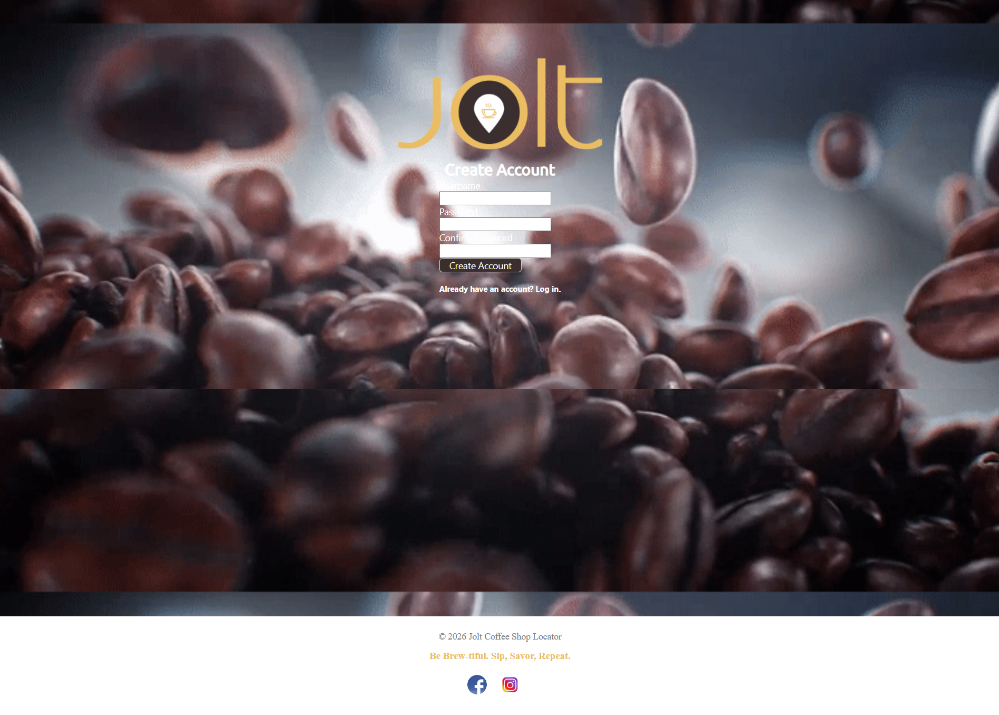
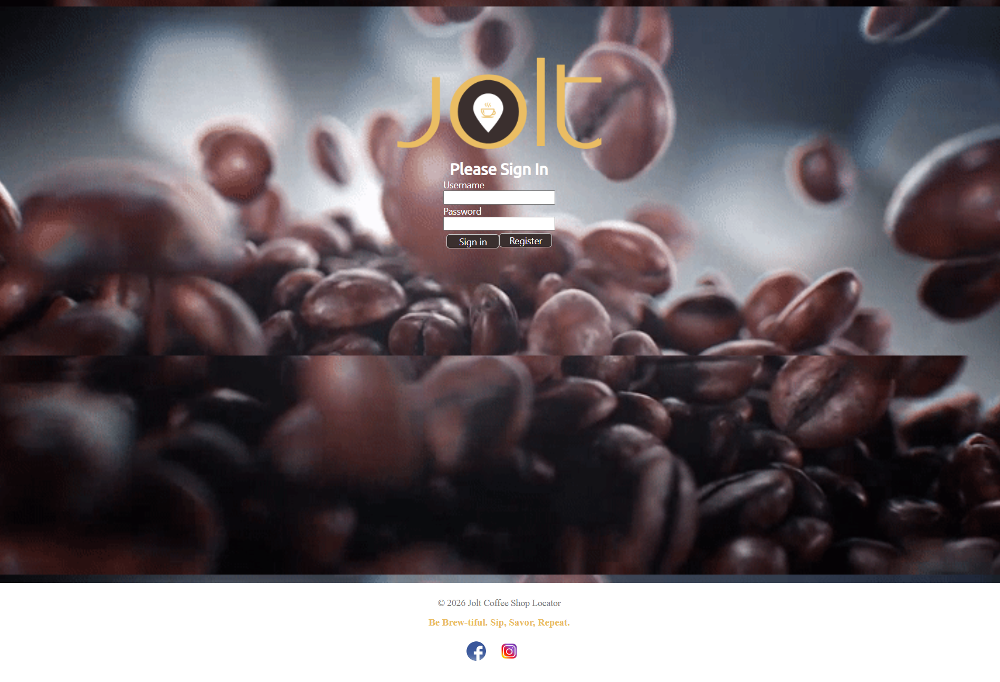
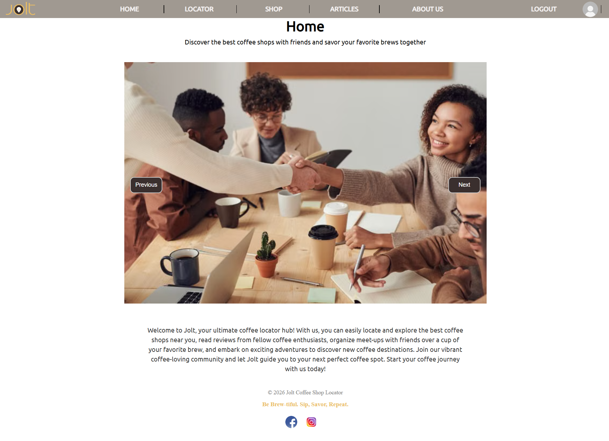
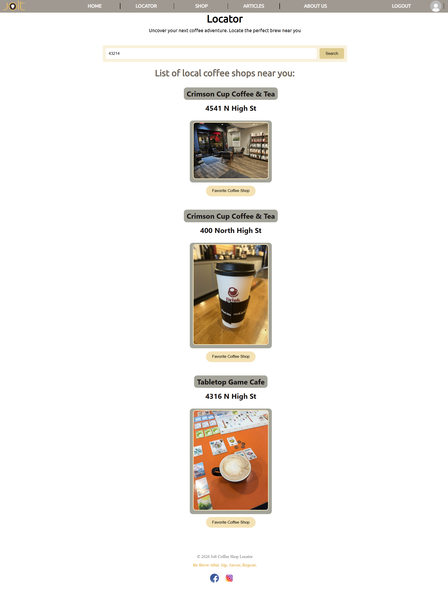
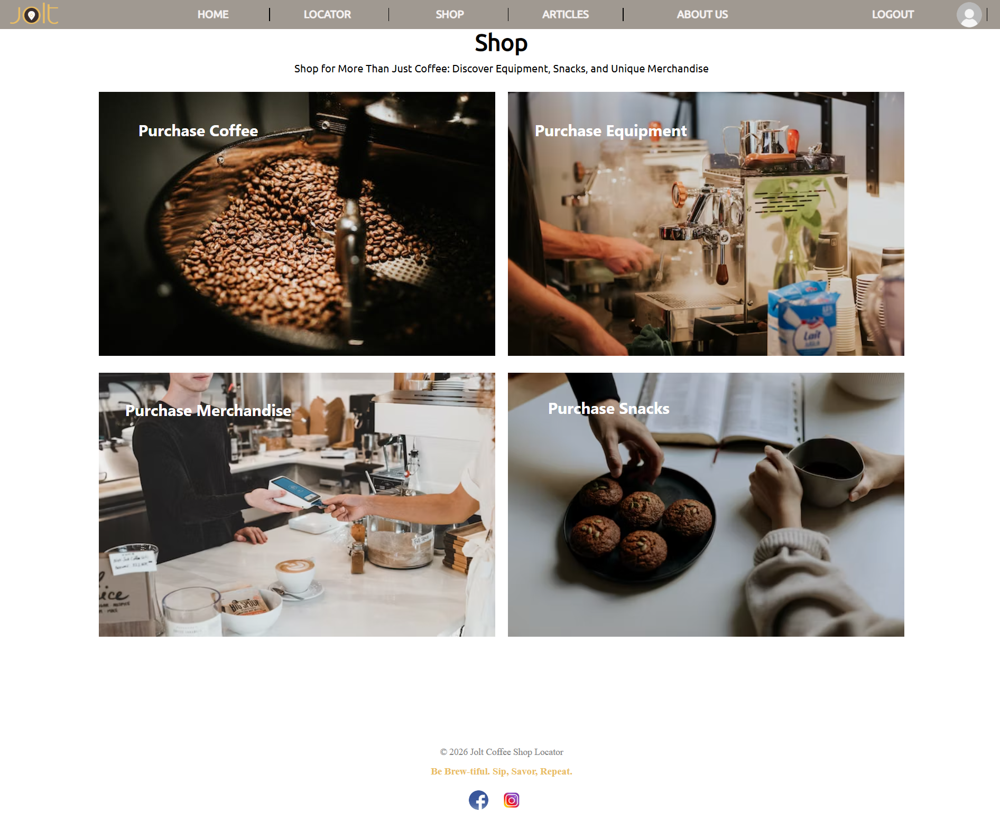

# Coffee Shop Locator Application

### Full-Stack Business Discovery Application

The Coffee Shop Locator Application is a full-stack business discovery application that centralizes local coffee shop information into a unified user experience.

Developed as the capstone project for the Tech Elevator Full-Stack Java Bootcamp, the application demonstrates collaborative software development, business systems analysis, API integration, relational database design, and full-stack web development.

The project combines authenticated user access with real-time business data to provide a centralized coffee shop discovery experience.

---

## Project Overview

The Coffee Shop Locator Application helps users discover nearby coffee shops by combining authenticated access with real-time business information from the Yelp Fusion API.

Users can:

- Register and log into the application
- Search nearby coffee shops
- View real-time business information
- Browse educational coffee-related articles

All within a single, streamlined user experience.

---

## Key Features

### User Authentication

- User registration
- Secure user login
- Protected application access

### Business Discovery

- Search nearby coffee shops using Yelp Fusion API data
- View business details, ratings, and location information
- Browse local businesses through a centralized interface

### Educational Content

- Browse coffee-related informational articles
- Explore educational resources within the application

---

## System Architecture

### Frontend

- Vue.js
- JavaScript
- HTML5
- CSS3
- Axios

### Backend

- Java
- Spring Boot
- RESTful API
- JDBC

### Database

- PostgreSQL

### External Services

- Yelp Fusion API

---

## Technical Implementation

The application follows a traditional client-server architecture with a Vue.js frontend communicating with a Spring Boot REST API backed by PostgreSQL.

As part of a collaborative development team, I contributed to both frontend and backend implementation throughout the capstone project.

Key contributions included:

- Designed user interfaces supporting business discovery workflows
- Integrated the Yelp Fusion API for real-time business data retrieval
- Implemented user registration and authentication functionality
- Developed RESTful communication between frontend and backend systems
- Designed PostgreSQL database structures supporting application data
- Applied full-stack development practices using Java, Spring Boot, Vue.js, and PostgreSQL
- Collaborated with teammates using Git and GitHub throughout the software development lifecycle

---

## Technology Stack

| Category | Technologies |
|-----------|-------------|
| Frontend | Vue.js, JavaScript, HTML5, CSS3, Axios |
| Backend | Java, Spring Boot, JDBC |
| Database | PostgreSQL |
| APIs | Yelp Fusion API |
| Tools | Git, GitHub, IntelliJ IDEA |

---

## Screenshots

The following screenshots demonstrate the primary user workflows throughout the application.

### Register

Create a new user account.

---

### Login

Secure user authentication for registered users.

---

### Home Page

Introduces the application and primary navigation.

---

### Coffee Shop Search

Displays nearby coffee shops retrieved from the Yelp Fusion API.

---

### Shop Details

Displays business information and available user actions.

---

### Articles

Browse educational coffee-related content within the application.

---

## Future Enhancements

- User profile management
- Favorites functionality
- Responsive layout for tablets and mobile devices
- Enhanced search filtering
- User reviews and ratings
- Interactive mapping functionality

---

## Author

**Jennifer Curtis**

Business Systems Analyst | Full-Stack Developer

🌐 **Portfolio:** [jennifercurtis.me](https://jennifercurtis.me)

💼 **LinkedIn:** [linkedin.com/in/jcurtisdeveloper](https://linkedin.com/in/jcurtisdeveloper)

💻 **GitHub:** [github.com/craftycurtis05](https://github.com/craftycurtis05)
